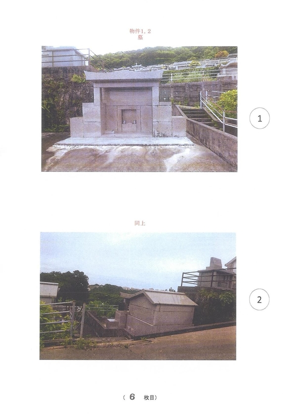

A summary of the terms of the planned Remilia Collective contract agreed upon by all Remilia Collective artists.

## Terms

Remilia Collective artists commit to exclusively selling NFT art on the Remilia Collection market, providing 20% flat commission to Remilia Corp and 10% additional into Remilia Co-op funding (70% final compensation) on every sale.

Remilia Corp may match ~5-10% funding into the Remilia Co-op (to make effective Co-op contribution = 15-20% total of all NFT sales), with the remainder retained for Remilia Corp's working capital for operations and project investments.

Ownership of a work is transferred to Remilia Corp on consignment when it is delivered to the Market and the NFT is minted, with payment distributed back to the artist from Remilia Corp as a portion of the sale on first sale.

## Co-Op Fund

Remilia Co-op is formed of 1 equal share provided to each artist in the Remilia Collective. The Co-op is an investment portfolio contributed to in all Collection sales. Quarterly, interest earnings will be redistributed to Co-op members equally.

### Goal

The goal of the fund is two-fold: reach a point where members of the co-op can each have their livelihood supported by the Co-op fund to allow full-time focus on their work, and encourage a collaborative family, such that if one person comes up, we all do.

### Transparency

The Co-op will meet virtually once a quarter where Remilia Collection sales and portfolio performance will be reported and payouts distributed; Patron Fund distribution will be negotiated and voted on alongside shareholders, and for general transparency reports on direction of Remilia Corp, etc.

### Selling Out

At the quarterly meeting, any Artists can choose to sell out of the collective by exchanging their Co-op share in exchange for their lifetime contribution to the co-op (10% of NFT sales) minus lifetime co-op payouts; lifetime contribution resetting on the formation of the Remilia Trust.

### Note: Remilia Co-Op Investment Schedule

The first year or so will not have interest redistribution and an increased RemCorp contribution (10% match = 20% of all NFT sales) to focus on building the fund; we will probably hold a high-risk crypto portfolio until a certain number is reached, and then progressively move the portfolio towards lower risk investments where interest can safely accumulate.

*(In lieu of interest payouts if crypto valuation increases make up the substantial portion of earnings, we can structure a pay out a percentage of YTD earnings up to a certain figure.)*

## Remilia Trust

The Remilia Trust will be initiated once the Remilia Co-op's fund hits a TBD target number, at which point the Co-op fund will be re-organized into a series of equal, individual trusts for each member paying out interest monthly until death.

### Target

The Remilia Trust's target goal is to provide an ample salary (say, $100K annual) for every member of the Collective, maintained into perpetuity by investing into a conservative index fund and paying out interest (after a portion reinvested to meet inflation).

## Remilia Colony

With the Remilia Trust formation, the Remilia Co-op fund will be drained empty. On NG+, there will be no quarterly payouts; the fund will act as a full investment portfolio, primarily towards the goal of buying land and property for the Remilia Colony.

### Village by The Sea

The Remilia Colony will identify a suitable low population, rural Japanese village located with views of both the mountains and the sea with homes for sale in the traditional Japanese architecture. Remilia Co-op funds will be used to buy up a colony of traditional Japanese houses, one for every Remilia Collective member, and following that, important village land and infrastructure, until the village is dominated and controlled by Remilia and her affiliates.

*Note: We will run a perpetual broth restaurant with one big vat in the back and wooden communal bench seating that sells bowls for 300 yen and the waitresses dress like shrine maidens, but if you join the Remilia Soup profit-sharing cooperative, membership dues only 3,000 yen a month, you get one bowl a day for free and access to monthly Remilia Raves, and a quarterly redistribution of profits. (NOTE: We also sell housebrewed sake, eggs from the chicken coop in the back, and clay dishware made by the waitresses.) It will be a franchise targeting rural Japan.*

