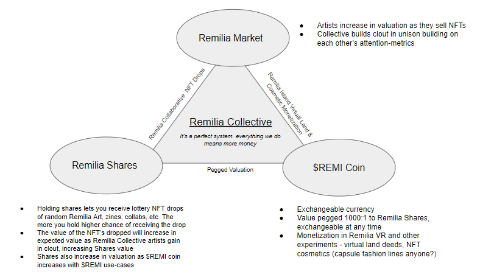

ETH Contract to create Remi Coin ($REMI). 

## Exchange Mechanism

1,000 $REMI will always be convertible to 1 RCS and vice versa. RCS sale price will be pegged to $REMI valuation - if an RCS is worth more, so is $REMI (and vice versa). 
Possible volume tied to minted RCS, e.g. 

## Functional Coin for Use in Projects

Planned to be used in any Remilia project possible, e.g. cosmetics for Remilia Island (VR social chat)

## The Value Pyramid

Value derivation is designed in a deeply interconnected triangle between three financial vehicles: 

1) The Remilia Market, and the NFT art world value it entails for artists
2) The Remilia Share Token (RST), and the value of its NFT Art Drops, Dispatches and Remilia Access Benefits
3) The $REMI Coin, and its value in use in Remilia Projects

Each point of the triangle are tied together by either shared Artist Clout or interconvertibility, such that value introduced to one reflects in all.

Each aspect of value will be broken down in the following sections.