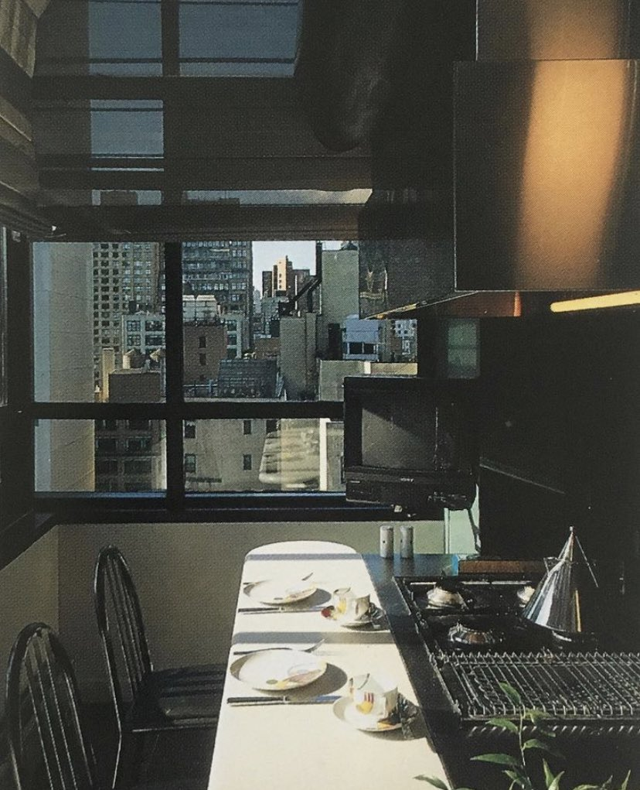

## What is Remilia?

We are an embodiment — We're God's little warriors, We're network kommandos. We're whitepilled. We're lawyered up, in the court of clout. Nothing we can do can be cringe, except when it is and then we don't care, we don't care. We're live laugh lovers, and we put all our points into karma, charm and beauty. We're cDJs, we're fashion models, we're microdosers, and supplement freaks. We're lindy, we're Wired, we're Not in Employment Education or Training. We're viral cryptoxillionaires. We don't have to try. We're the new art.

**And so we self-organized into Remilia.**

Remilia is an institution. Remilia, is a self-organization. Remilia is a lifestyle brand. Remilia, is a master-planned community. Remilia is an investment fund. Remilia is an artist's colony. Remilia is a crowdfunded video game. Remilia is an autonomous smart contract. Remilia is an independent record label. Remilia is a community center for the digital village. Remilia is a manifesto. Remilia will save the internet.

*- [I Long For Network Spirituality](https://ilongfornetworkspirituality.net/), Opening text*

## What does Remilia Believe?

- Posting is the New Art
- Abundance Mindset
- Embrace the Network, Against Authorship
- Whitepilled: Love and Optimism
- Living is the Art, Lifestyle the Manifesto
- Longpost into the Heart
- Every Medium can be Creative

## What is the Remilia Gambit?

This generation is experiencing an abundance of online artists -- true artists, who live every aspect of their lives as art -- at the same time that they are demoralized from producing in any frame compatible with the art world; but they do make it, every day, in everything they do. They see the art world as stratified, institutional, bureacratic, careful and conservative -- they've lost relevance in commentary for the contemporary and no longer exist in a position as the upstream of culture; the digital world isn't understood by them even as it takes over the real.

Commodifiability of art isn't important for the money, but the legitimacy the market provides it, enabling its appreciation and consumption. Until an art can be rendered into institutional lens, it struggles to receive due appreciation.

NFT widens the range of sellable "mediums" to the most abstracted possible. Like Duchamp's signature on a readymade, the act of minting an NFT turns anything into work - now with no barrier to being shown as such in a gallery context. The NFT Art World is the first time in decades that the art world has been in a serious position of disruption. While it exists today as largely parallel to the "real" art world, I believe it's inevitable for NFT technology to be integrated due to fixing real issues of provenance.*

When this happens, we're sitting on a well-established model that can be accepted as the new form. We now have the power to teach the world to appreciate our body of works, as they are. That's the Remilia gambit. Remilia is reclaiming what's ours.

*- Email from Remilia Jackson, 1.18.21:*

## Conceptual Glossary

### Collaborative Abundance Network

A network maintaining an ethos of free collaboration rather than fierce competition manifesting in higher returns for all; FOSS model of software development is a textbook example. This is hinged on a mindset of abundance, producing an attitude of sharing and teamwork amongst peers towards the common good of Art.

Anti-thetical to the mainstream mode of content creators, who, fighting over scraps in a flattened field, embody the scarcity mindset. The isolationist scarcity networks are those who refuse to share ideas, materials, templates, guides and constantly bother themselves over "stolen" ideas or missing "credit". Counter-intuitively, a focus on personal monetary gain results in less than what is obtained in collaborative abundance network.

*"Remilia Collective aims to be a city on the hill for the collaborative abundance network. It will first prove its optimism by achieving success itself.*

*Virtues include: Open information access, Financial and Social Generosity, and Copylefting and encouraging riffing, duping & remixing."*

***- Remilia Jackson***

### Speculation Convolution Matrix

Complex financial vehicles often form a heavily abstracted speculative market divorced from any sensible measures of real value due to the chaotic complexity involved. This can be achieved in the minitaure by through the combination of two or more speculative valuations into one asset attempting to be priced, e.g. an art piece collaborated on by two rising art stars. This is called a speculation convolution matrix, because it forms a convoluted matrix between multiple speculations.

*"Complicating speculation is of interest to Remilia Corp. It encourages a much deeper engagement in the field than a mere buy it and sit on it investment. Each new currency or contract structure is a radically new financial mini-game that must be collectively learned.*

*The high volatility of the price-discovery period leads to many exciting moments, and as it settles into an understood market, it's achieved the introduction of a kind of self-sustaining alternate-reality algorithm, powered by the engine of capitalism. As an artistic construction, this interests us."*

***- Remilia Jackson***

### Network Lucidity

*"We're on the cusp of the new mode; posting is the work -- When you post, your enter a lucid, ascetic state, a communion with the network. It's not just media produced in the dark room alone, one picture a day for a 100 days. A video worked on for a week, and uploaded modestly to your page, then linked desperately to anyone you meet. No, it's networked. Authorship died by being distributed."*

***- Remilia Jackson***
